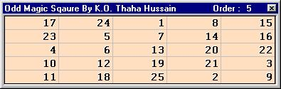

<div align="center">

## a  \- Odd Magic Square


</div>

### Description

Magic square is a set of numbers arranged in a particular order whose column-wise, row-wise and diagonal-wise sums are all the same. This program explains the mathematics behind an odd magic square.

Magic, Fun, Maths, Interesting, Easy even for beginners and excellent!!
 
### More Info
 
Place an MS Flex Grid Control. Name it Grid.


<span>             |<span>
---                |---
**Submitted On**   |
**By**             |[K\. O\. Thaha Hussain](https://github.com/Planet-Source-Code/PSCIndex/blob/master/ByAuthor/k-o-thaha-hussain.md)
**Level**          |Intermediate
**User Rating**    |4.6 (23 globes from 5 users)
**Compatibility**  |VB 5\.0, VB 6\.0
**Category**       |[Math/ Dates](https://github.com/Planet-Source-Code/PSCIndex/blob/master/ByCategory/math-dates__1-37.md)
**World**          |[Visual Basic](https://github.com/Planet-Source-Code/PSCIndex/blob/master/ByWorld/visual-basic.md)
**Archive File**   |[](https://github.com/Planet-Source-Code/k-o-thaha-hussain-a-odd-magic-square__1-22626/archive/master.zip)


### Source Code

```
'(C) K. O. Thaha Hussain. All rights reserved
'Analyst Programmer
'Company: http://www.induswareonline.com
'URL: http://www.bcity.com/thahahussain
'Note: Adjust the DataTypes to make room for
'large numbers..
'
'The Behind Scene Mathematics is simple!
'Step1. Begin 1 at the middle of the first row
'Step2. Next number should be one row up
'   one column right
'Step3. If the present row < the first then
'        make it last
'Step4. If the present column > the last then
'        make it first
'Step5. The rule for the number which follows
'       the multiple of the
'  order of magic square, is one row down
'Finished!!
Option Explicit
Dim N As Integer
Private Sub Form_Load()
Do While N Mod 2 = 0
 N = Val(InputBox("Enter an Odd Number (Ex: 3, 5, 7 etc.)", _
 "Order of Magic Square", 5))
Loop
 Grid.BackColor =
 Grid.FixedCols = 0
 Grid.FixedRows = 0
 Grid.Left = 0
 Grid.Top = 0
 Grid.Rows = N
 Grid.Cols = N
 Me.Caption = "Odd Magic Sqaure By K.O. Thaha Hussain " _
   & "   Order : " & Str(N)
 Call MagicSquare
End Sub
Private Sub Form_Resize()
 Grid.Width = Me.ScaleWidth
 Grid.Height = Me.ScaleHeight
End Sub
Private Sub MagicSquare()
Dim Row As Integer, Column As Integer, I As Integer, Number As Integer
 Dim Magic(100, 100) As Integer
 Number = 1
 Row = 0
 Column = (N + 1) / 2 - 1
 Magic(Row, Column) = Number
 For I = 2 To N * N
 If Number Mod N <> 0 Then
  Row = Row - 1
  Column = Column + 1
 Else
  Row = Row + 1
 End If
 If Row < 0 Then Row = N - 1
 If Column > N - 1 Then Column = 0
 Number = Number + 1
 Magic(Row, Column) = Number
 Next I
'Loops to put the values into grid
For Row = 0 To N - 1
 For Column = 0 To N - 1
  Grid.Row = Row
  Grid.Col = Column
  Grid.Text = Format(Magic(Row, Column), "#####")
 Next Column
Next Row
End Sub
```

